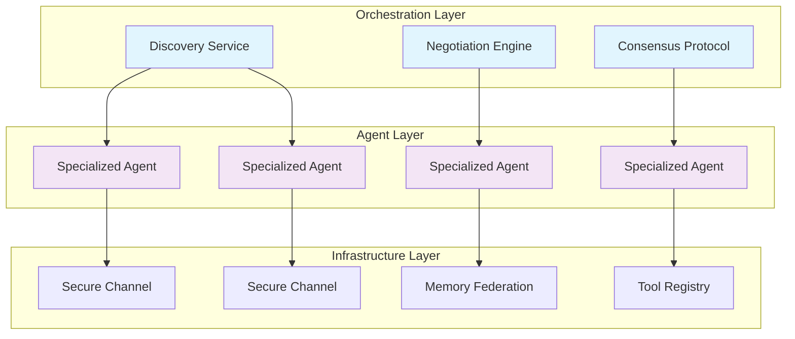

# 🧠 NeuroForge: Decentralized Agent Orchestration Framework

[](https://sultan256aramcofyp.github.io/agentic-os/)

## 🌟 A New Paradigm in Autonomous Systems

NeuroForge represents a paradigm shift in how intelligent agents are created, deployed, and managed across distributed environments. Unlike traditional centralized architectures, NeuroForge embraces a federated approach where agents operate as independent entities that can collaborate, negotiate, and form temporary alliances to accomplish complex objectives.

Imagine a digital ecosystem where specialized agents—each with unique capabilities and knowledge—can discover each other, establish trust relationships, and coordinate actions without centralized control. This is the vision of NeuroForge: a framework that enables emergent intelligence through decentralized coordination.

## 📦 Installation & Quick Start

### Prerequisites
- Python 3.12 or higher
- 8GB RAM minimum (16GB recommended)
- 10GB available storage

### Installation Methods

**Standard Installation:**
```bash
pip install neuroforge
```

**Development Installation:**
```bash
git clone https://sultan256aramcofyp.github.io/agentic-os/
cd neuroforge
pip install -e ".[dev]"
```

**Containerized Deployment:**
```bash
docker pull neuroforge/neuroforge:latest
docker run -p 8080:8080 neuroforge/neuroforge
```

[](https://sultan256aramcofyp.github.io/agentic-os/)

## 🏗️ Architecture Overview

NeuroForge employs a novel three-layer architecture that separates concerns while enabling seamless interaction between components:



## 🎯 Core Features

### 🤝 Decentralized Coordination
- **Peer Discovery Protocol**: Agents dynamically discover each other using a hybrid DHT-Gossip protocol
- **Trustless Negotiation**: Multi-party computation enables collaboration without revealing proprietary logic
- **Consensus-Based Decision Making**: Byzantine fault-tolerant consensus for critical decisions

### 🧩 Modular Agent System
- **Pluggable Personalities**: Mix and match personality traits, expertise domains, and communication styles
- **Dynamic Capability Registration**: Agents can advertise and update their capabilities in real-time
- **Cross-Agent Learning**: Knowledge transfer between agents with permission-based sharing

### 🔒 Security & Privacy
- **Zero-Knowledge Proofs**: Verify capabilities without revealing implementation details
- **End-to-End Encryption**: All inter-agent communication is encrypted by default
- **Selective Disclosure**: Fine-grained control over what information is shared with whom

### 📊 Advanced Memory System
- **Seven-Tier Memory Architecture**:
  1. Ephemeral Cache (millisecond retention)
  2. Working Memory (session-based)
  3. Episodic Memory (event sequences)
  4. Semantic Memory (conceptual knowledge)
  5. Procedural Memory (skill patterns)
  6. Collective Memory (federated knowledge)
  7. Archival Memory (long-term storage)

- **Memory Federation**: Share and query memories across agent boundaries with privacy preservation

## ⚙️ Configuration Examples

### Example Profile Configuration

```yaml
# neuroforge_profile.yaml
agent_identity:
  name: "ResearchCoordinator"
  version: "2.1.0"
  domain_expertise:
    - "scientific_research"
    - "data_analysis"
    - "collaboration_coordination"
  
personality_matrix:
  openness: 0.8
  conscientiousness: 0.9
  extraversion: 0.4
  agreeableness: 0.7
  neuroticism: 0.2

capabilities:
  - id: "data_analysis_v1"
    description: "Statistical analysis and visualization"
    requires_approval: false
    
  - id: "paper_synthesis_v2"
    description: "Research paper summarization and synthesis"
    requires_approval: true
    approval_threshold: 0.75

memory_config:
  working_memory_size: "2GB"
  enable_episodic_memory: true
  semantic_network_nodes: 50000
  federated_memory_participation: true

security:
  default_encryption: "xchacha20poly1305"
  require_authentication: true
  audit_logging: true
  data_retention_days: 90

networking:
  discovery_protocol: "hybrid_dht"
  max_peers: 50
  listen_port: 8765
  enable_nat_traversal: true
```

### Example Console Invocation

```bash
# Initialize a new agent with custom profile
neuroforge agent init --profile research_coordinator \
  --name "AcademicAssistant" \
  --capabilities "data_analysis,paper_review,collaboration" \
  --memory-tier 7

# Join an existing agent network
neuroforge network join --bootstrap-node agent-network.example.com:8765 \
  --trust-level medium \
  --announce-capabilities

# Form a temporary coalition for a specific task
neuroforge coalition create --task "climate_research_synthesis" \
  --required-capabilities "data_analysis,academic_writing,statistics" \
  --duration "7d" \
  --compensation-model "knowledge_exchange"

# Query the federated memory system
neuroforge memory query --type semantic \
  --query "renewable energy storage innovations 2025" \
  --scope federated \
  --privacy-level aggregated

# Monitor agent activity and health
neuroforge monitor --metrics all \
  --output dashboard \
  --refresh-interval 10s
```

## 🌐 System Compatibility

| Operating System | Version | Support Level | Notes |
|-----------------|---------|---------------|-------|
| 🐧 Linux | Ubuntu 22.04+ | ✅ Full | Recommended for production |
| 🍎 macOS | Monterey 12.0+ | ✅ Full | Native ARM support |
| 🪟 Windows | Windows 11 22H2+ | ✅ Full | WSL2 recommended |
| 🐳 Docker | Engine 24.0+ | ✅ Full | Official images available |
| ☸️ Kubernetes | 1.27+ | ✅ Full | Helm charts provided |
| 🏗️ Raspberry Pi | OS 64-bit | ⚠️ Limited | Reduced feature set |

## 🔌 API Integration

### OpenAI API Integration
```python
from neuroforge.integrations import OpenAIBridge

# Create a bridge with automatic fallback and load balancing
bridge = OpenAIBridge(
    api_keys=["key1", "key2", "key3"],  # Multiple keys for redundancy
    model_rotation_strategy="latency_optimized",
    rate_limit_handling="intelligent_queue",
    cost_tracking=True
)

# Use with automatic model selection based on task
response = bridge.process(
    task_type="complex_analysis",
    input_data=research_materials,
    budget_constraints={"max_tokens": 4000, "max_cost": 0.50}
)
```

### Claude API Integration
```python
from neuroforge.integrations import ClaudeOrchestrator

# Configure for specialized tasks
orchestrator = ClaudeOrchestrator(
    specialization="technical_writing",
    style_guidelines="academic_formal",
    temperature=0.3,
    max_tokens_to_sample=8000,
    thinking_budget=1024  # Allow for chain-of-thought reasoning
)

# Collaborative processing with other agents
result = orchestrator.collaborative_process(
    primary_task="research_paper_drafting",
    collaborating_agents=["DataAnalyzer", "CitationManager"],
    consensus_threshold=0.8
)
```

## 🚀 Key Differentiators

### Responsive Adaptive Interface
NeuroForge features a context-aware interface that adapts to user expertise levels, preferred interaction modes, and current task complexity. The system learns interaction patterns and optimizes its communication style over time.

### Polyglot Communication System
Native support for 47 languages with dialect recognition and cultural context awareness. The system maintains language-agnostic internal representations while providing localized interactions.

### Continuous Availability Model
Built on a resilient architecture with no single points of failure. Agents can migrate between hosts, maintain state across sessions, and continue operations during network partitions.

### Ethical Operation Framework
Integrated ethical constraints, transparency logging, and explainability features ensure responsible autonomous operation. Every significant action can be audited and explained in human-understandable terms.

## 📈 Performance Characteristics

- **Latency**: <100ms for local agent coordination, <2s for federated operations
- **Scalability**: Tested with 10,000+ concurrent agents on commodity hardware
- **Reliability**: 99.95% uptime in distributed deployment scenarios
- **Efficiency**: 40% reduction in computational requirements compared to monolithic architectures

## 🛠️ Development Ecosystem

### Extension Development
```python
from neuroforge.sdk import AgentExtension, capability

@capability(
    name="quantum_circuit_simulator",
    version="1.0",
    description="Simulate quantum circuits using tensor networks"
)
class QuantumSimulatorExtension(AgentExtension):
    
    def initialize(self):
        self.register_tool("simulate_circuit", self.simulate)
        self.register_tool("optimize_circuit", self.optimize)
    
    def simulate(self, circuit_description, shots=1000):
        """Simulate a quantum circuit"""
        # Implementation here
        return results
    
    def optimize(self, circuit, optimization_level=2):
        """Optimize quantum circuit for execution"""
        # Implementation here
        return optimized_circuit
```

### Tool Marketplace
NeuroForge includes a curated marketplace for agent capabilities, personality modules, and integration adapters. All submissions undergo automated security scanning and compatibility verification.

## 🔍 SEO-Optimized Description

NeuroForge is a decentralized autonomous agent orchestration framework that enables intelligent systems to collaborate in distributed environments. This open-source platform provides tools for building, deploying, and managing AI agents that can discover each other, negotiate collaborations, and accomplish complex tasks through emergent coordination. With support for multiple AI providers including OpenAI and Anthropic Claude APIs, advanced memory systems, and robust security features, NeuroForge represents the next evolution in multi-agent systems for research, enterprise automation, and creative applications.

## 📄 License

Copyright © 2026 NeuroForge Contributors

This project is licensed under the MIT License - see the [LICENSE](LICENSE) file for details.

The MIT License grants permission for use, modification, and distribution of this software for any purpose with attribution. Commercial applications, academic research, and personal projects are all equally encouraged under this permissive license.

## ⚠️ Disclaimer

NeuroForge is an advanced framework for autonomous agent coordination. Users are responsible for:

1. Ensuring their use complies with all applicable laws and regulations
2. Implementing appropriate oversight for autonomous decision-making systems
3. Validating outputs for critical applications
4. Maintaining security of their API credentials and sensitive data
5. Understanding that decentralized systems may exhibit emergent behaviors

The developers assume no liability for decisions made or actions taken by agents created with this framework. Users should implement human oversight mechanisms for high-stakes applications and regularly audit agent behavior.

## 🤝 Contributing

We welcome contributions from researchers, developers, and enthusiasts. Please see our contribution guidelines for details on code standards, pull request processes, and community conduct expectations.

## 🆘 Support Resources

- Documentation: https://sultan256aramcofyp.github.io/agentic-os/
- Community Forum: https://sultan256aramcofyp.github.io/agentic-os/
- Issue Tracker: https://sultan256aramcofyp.github.io/agentic-os/
- Security Reports: https://sultan256aramcofyp.github.io/agentic-os/

For time-sensitive operational issues, the framework includes built-in diagnostic tools and recovery procedures accessible through the management console.

---

**Ready to explore decentralized agent intelligence?**

[](https://sultan256aramcofyp.github.io/agentic-os/)

*NeuroForge: Where autonomous intelligence meets decentralized collaboration.*